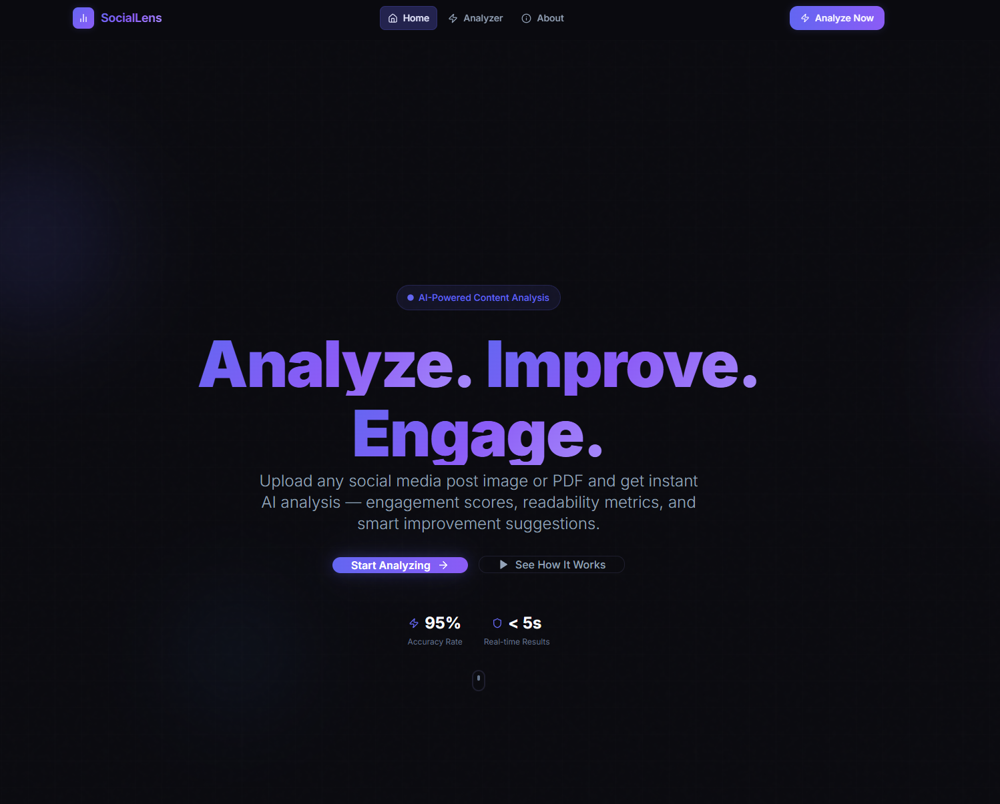
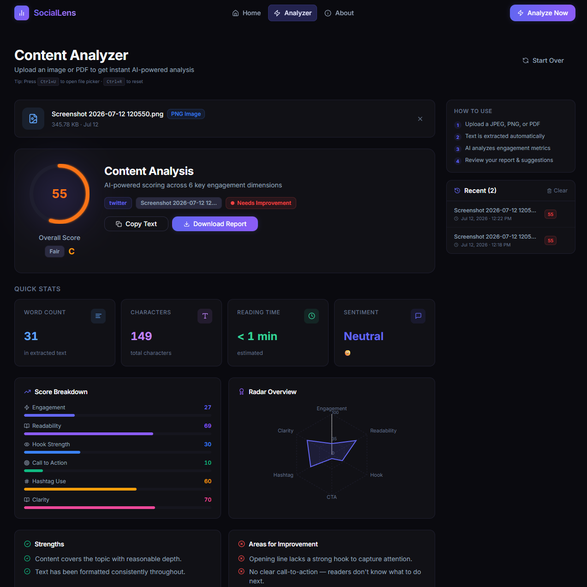
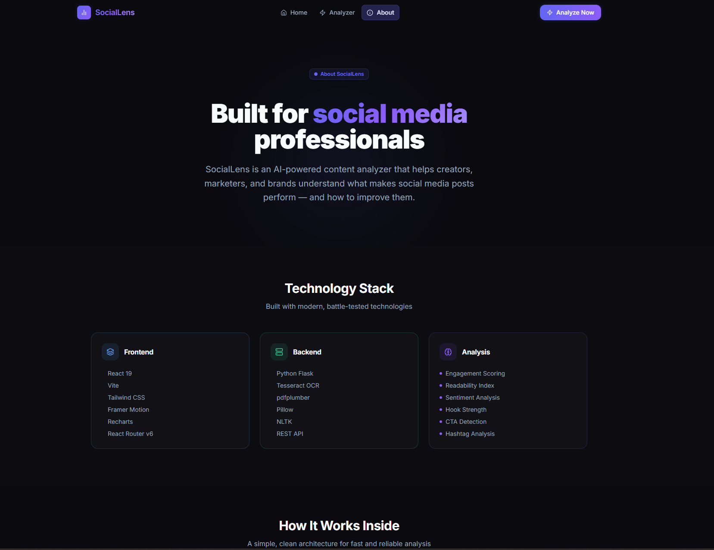
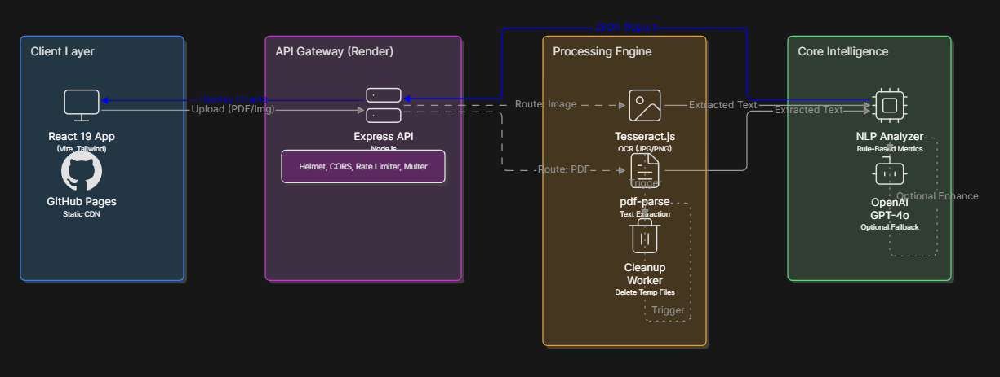

# SocialLens

<div align="center">


[](https://react.dev)
[](https://vitejs.dev)
[](https://tailwindcss.com)
[](https://nodejs.org)
[](https://expressjs.com)
[](https://opensource.org/licenses/MIT)
[](http://makeapullrequest.com)
[](https://pages.github.com)

**AI-powered social media content analysis. Upload a PDF or image — get actionable insights in seconds.**

[Live Demo](https://yourusername.github.io/Unthinkable_Solution_Assignment) · [API Docs](#api-endpoints) · [Report Bug](https://github.com/yourusername/Unthinkable_Solution_Assignment/issues) · [Request Feature](https://github.com/yourusername/Unthinkable_Solution_Assignment/issues)

</div>

---

## 📸 Application Screenshots

| Home & Upload Flow | Comprehensive Analysis Report | About & Technology Stack |
|:---:|:---:|:---:|
|  |  |  |

---

## ✨ Features

### Core
- 📄 **PDF Parsing** — Extract text from any PDF using `pdf-parse` with metadata (pages, author, title)
- 🔍 **OCR (Optical Character Recognition)** — Extract text from JPG/PNG images using `Tesseract.js`
- 🧠 **Smart Analysis Engine** — 10+ engagement metrics: readability, CTA strength, hashtag optimization, hook power, emoji usage, sentiment, and more
- 🤖 **Optional OpenAI Integration** — Plug in your API key for GPT-4o-mini powered analysis
- 📋 **Copy & Download** — Copy extracted text or download a full analysis report

### UI/UX
- 🌑 **Dark Mode by Default** — Near-black premium dark theme
- 🎯 **Drag & Drop Upload** — Animated dropzone with live validation
- 📊 **Visual Dashboard** — Animated progress rings, radar charts, metric cards
- ✨ **Micro-interactions** — Framer Motion animations throughout
- 📱 **Fully Responsive** — Mobile-first, works on all screen sizes
- ♿ **Accessible** — ARIA labels, keyboard navigation, proper focus management

### Security
- 🛡️ **Helmet.js** — HTTP security headers
- 🚧 **Rate Limiting** — 100 requests per 15 minutes
- 🔒 **MIME Validation** — Server-side file type verification
- 🧹 **Filename Sanitization** — Directory traversal prevention
- 🗑️ **No File Storage** — Uploaded files deleted immediately after processing

---

## 🏗️ Architecture

<div align="center">



</div>

---

## 🛠️ Tech Stack

### Frontend
| Technology | Purpose |
|---|---|
| React 19 | UI framework |
| Vite 5 | Build tool & dev server |
| Tailwind CSS 3 | Utility-first styling |
| Framer Motion | Animations & transitions |
| React Router v6 | Client-side routing |
| React Hook Form | Form state management |
| React Dropzone | File drag-and-drop |
| Axios | HTTP client |
| Recharts | Data visualization |
| Lucide React | Icon library |
| React Hot Toast | Toast notifications |

### Backend
| Technology | Purpose |
|---|---|
| Node.js 20 | JavaScript runtime |
| Express.js 4 | Web framework |
| Tesseract.js 5 | OCR engine |
| pdf-parse | PDF text extraction |
| Multer | File upload middleware |
| Helmet | HTTP security headers |
| CORS | Cross-Origin Resource Sharing |
| express-rate-limit | API rate limiting |
| express-validator | Input validation |
| Morgan | HTTP request logging |
| OpenAI (optional) | GPT-powered analysis |

---

## 📁 Folder Structure

```
Unthinkable_Solution_Assignment/
├── frontend/                    # React 19 application
│   ├── public/                  # Static assets
│   ├── src/
│   │   ├── animations/          # Framer Motion variants
│   │   │   └── variants.js
│   │   ├── assets/              # Images, SVGs
│   │   ├── components/
│   │   │   ├── analysis/        # Results dashboard components
│   │   │   │   ├── AnalysisReport.jsx
│   │   │   │   ├── ImprovedVersion.jsx
│   │   │   │   ├── MetricCard.jsx
│   │   │   │   ├── ScoreRing.jsx
│   │   │   │   └── SuggestionCard.jsx
│   │   │   ├── landing/         # Landing page sections
│   │   │   │   ├── FeatureCards.jsx
│   │   │   │   ├── HeroSection.jsx
│   │   │   │   └── HowItWorks.jsx
│   │   │   ├── layout/          # App shell
│   │   │   │   ├── Footer.jsx
│   │   │   │   └── Navbar.jsx
│   │   │   └── ui/              # Reusable primitives
│   │   │       ├── Badge.jsx
│   │   │       ├── Button.jsx
│   │   │       ├── Card.jsx
│   │   │       ├── Modal.jsx
│   │   │       ├── ProgressRing.jsx
│   │   │       ├── Skeleton.jsx
│   │   │       └── Toast.jsx
│   │   │   └── upload/          # Upload flow components
│   │   │       ├── DropZone.jsx
│   │   │       ├── FilePreview.jsx
│   │   │       └── UploadProgress.jsx
│   │   ├── context/             # React contexts
│   │   │   ├── AnalysisContext.jsx
│   │   │   └── ThemeContext.jsx
│   │   ├── hooks/               # Custom React hooks
│   │   │   ├── useAnalysis.js
│   │   │   ├── useFileUpload.js
│   │   │   ├── useKeyboardShortcuts.js
│   │   │   └── useLocalStorage.js
│   │   ├── pages/               # Route-level pages
│   │   │   ├── AboutPage.jsx
│   │   │   ├── AnalyzerPage.jsx
│   │   │   ├── LandingPage.jsx
│   │   │   └── NotFoundPage.jsx
│   │   ├── services/            # API communication
│   │   │   └── api.js
│   │   ├── utils/               # Shared utilities
│   │   │   ├── formatters.js
│   │   │   └── validators.js
│   │   ├── App.jsx
│   │   ├── index.css
│   │   └── main.jsx
│   ├── .env.example
│   ├── index.html
│   ├── package.json
│   ├── postcss.config.js
│   ├── tailwind.config.js
│   └── vite.config.js
│
├── backend/                     # Express.js API server
│   ├── config/
│   │   └── index.js             # Central configuration
│   ├── controllers/
│   │   ├── analyzeController.js
│   │   ├── healthController.js
│   │   └── uploadController.js
│   ├── middleware/
│   │   ├── errorHandler.js
│   │   ├── security.js
│   │   └── upload.js
│   ├── routes/
│   │   └── index.js
│   ├── services/
│   │   ├── analysisService.js   # Core analysis engine
│   │   ├── extractionService.js
│   │   ├── ocrService.js
│   │   └── pdfService.js
│   ├── uploads/                 # Temp upload directory (git-ignored)
│   ├── utils/
│   │   ├── fileUtils.js
│   │   └── logger.js
│   ├── .env.example
│   ├── package.json
│   └── server.js
│
├── ARCHITECTURE.md
└── README.md
```

---

## 🚀 Getting Started

### Prerequisites

- Node.js >= 18.0.0
- npm >= 9.0.0

### Installation

**1. Clone the repository**

```bash
git clone https://github.com/yourusername/Unthinkable_Solution_Assignment.git
cd Unthinkable_Solution_Assignment
```

**2. Set up the backend**

```bash
cd backend
cp .env.example .env
npm install
```

**3. Set up the frontend**

```bash
cd ../frontend
cp .env.example .env
npm install
```

---

## ⚙️ Environment Variables

### Backend (`backend/.env`)

| Variable | Default | Description |
|---|---|---|
| `NODE_ENV` | `development` | Environment mode |
| `PORT` | `5000` | Server port |
| `CORS_ORIGIN` | `http://localhost:5173` | Allowed frontend origin(s) — comma-separated for multiple |
| `OPENAI_API_KEY` | _(empty)_ | Optional — enables GPT-4o-mini analysis |
| `MAX_FILE_SIZE_MB` | `10` | Maximum upload file size |
| `RATE_LIMIT_WINDOW_MS` | `900000` | Rate limit window (15 min) |
| `RATE_LIMIT_MAX` | `100` | Max requests per window |

### Frontend (`frontend/.env`)

| Variable | Default | Description |
|---|---|---|
| `VITE_API_URL` | `http://localhost:5000/api` | Backend API base URL |

---

## 🏃 Running Locally

### Start the backend

```bash
cd backend
npm run dev
# Server running at http://localhost:5000
```

### Start the frontend

```bash
cd frontend
npm run dev
# App running at http://localhost:5173
```

Open [http://localhost:5173](http://localhost:5173) in your browser.

---

## 🌐 Deployment

### Frontend → GitHub Pages

**1. Update `vite.config.js`** — ensure `base` matches your repository name:
```js
base: '/your-repo-name/',
```

**2. Build the production bundle:**
```bash
cd frontend
npm run build
```

**3. Deploy using `gh-pages`:**
```bash
npm install -g gh-pages
gh-pages -d dist
```

**4. In GitHub repository settings:**
- Navigate to **Settings → Pages**
- Source: `gh-pages` branch, `/ (root)`

**5. Update the frontend `.env` with your Render backend URL:**
```
VITE_API_URL=https://your-app.onrender.com/api
```

### Backend → Render

**1. Push backend to GitHub**

**2. Create a new Web Service on [render.com](https://render.com)**:
- Root Directory: `backend`
- Build Command: `npm install`
- Start Command: `npm start`

**3. Add environment variables in Render dashboard:**
- `NODE_ENV=production`
- `CORS_ORIGIN=https://yourusername.github.io`
- `OPENAI_API_KEY=` (optional)

**4. Copy the Render service URL and update `VITE_API_URL` in the frontend**

---

## 📡 API Endpoints

### `GET /api/health`
Returns server health status.

**Response:**
```json
{
  "success": true,
  "data": {
    "status": "healthy",
    "version": "1.0.0",
    "uptime": 123.4,
    "timestamp": "2024-07-12T06:00:00.000Z"
  }
}
```

---

### `POST /api/upload`
Upload a file for text extraction.

**Request:** `multipart/form-data`
| Field | Type | Description |
|---|---|---|
| `file` | File | PDF, JPG, JPEG, or PNG (max 10 MB) |

**Response:**
```json
{
  "success": true,
  "data": {
    "extractedText": "Your extracted text here...",
    "metadata": {
      "mimeType": "image/jpeg",
      "category": "image",
      "confidence": 94.2
    },
    "fileInfo": {
      "name": "post.jpg",
      "size": 245120,
      "type": "image/jpeg"
    }
  }
}
```

---

### `POST /api/analyze`
Analyze extracted text for engagement metrics.

**Request:** `application/json`
```json
{
  "text": "Your social media post text here..."
}
```

**Response:**
```json
{
  "success": true,
  "data": {
    "overallScore": 78,
    "grade": "B+",
    "platform": "instagram",
    "metrics": {
      "wordCount": 42,
      "charCount": 256,
      "estimatedReadingTime": "< 1 min",
      "engagementScore": 82,
      "readabilityScore": 75,
      "sentimentScore": 0.6,
      "sentimentLabel": "Positive",
      "ctaScore": 90,
      "hashtagScore": 65,
      "hookStrength": 70,
      "emojiUsage": { "count": 3, "score": 80 },
      "clarityScore": 78,
      "grammarScore": 92
    },
    "strengths": ["Strong call-to-action", "Positive sentiment"],
    "weaknesses": ["Low hashtag count", "Weak opening hook"],
    "suggestions": [
      {
        "id": "hashtag-01",
        "category": "Hashtags",
        "priority": "high",
        "title": "Add more targeted hashtags",
        "description": "Posts with 5-10 hashtags get 36% more engagement on Instagram.",
        "example": "#SocialMedia #Marketing #ContentCreator"
      }
    ],
    "improvedVersion": "✨ Ready to transform your content game?..."
  }
}
```

---

## 🔐 Security Features

| Feature | Implementation |
|---|---|
| HTTP Security Headers | Helmet.js with strict CSP |
| CORS Policy | Whitelist-based origin validation |
| Rate Limiting | 100 req/15 min per IP |
| File Type Validation | Server-side MIME type whitelist |
| File Size Limit | 10 MB maximum |
| Filename Sanitization | Removes path traversal characters |
| No File Persistence | Files deleted immediately after processing |
| Input Sanitization | express-validator on all inputs |
| Environment Secrets | .env files, never committed |
| XSS Prevention | Helmet + proper Content-Type headers |

---

## ⚡ Performance Optimizations

- **Code Splitting** — Vendor, motion, and charts in separate chunks
- **Lazy Loading** — Route-level component lazy loading
- **React.memo** — Memoized pure components
- **useMemo / useCallback** — Computed values and stable callbacks
- **Framer Motion** — GPU-accelerated animations
- **Compression** — Gzip via Express `compression` middleware
- **Vite Build** — Tree-shaking, minification, chunk optimization
- **Tesseract Worker** — Terminated after use to free memory

---

## ♿ Accessibility

- Semantic HTML5 elements throughout
- ARIA labels on all interactive elements
- `aria-live` regions for dynamic content updates
- Full keyboard navigation support
- Visible focus indicators (never removed)
- Color contrast ratio ≥ 4.5:1 for all text
- Screen reader friendly loading states
- `role="alert"` for error messages
- `prefers-reduced-motion` respected

---

## 🔮 Future Improvements

- [ ] Multi-language OCR support (50+ languages via Tesseract)
- [ ] Bulk file upload (analyze multiple posts at once)
- [ ] Platform-specific analyzers (Twitter char limits, LinkedIn tone)
- [ ] Historical trend analysis (compare posts over time)
- [ ] Export to CSV/PDF report
- [ ] Browser extension for direct post analysis
- [ ] Collaboration features (share analysis with team)
- [ ] API key management dashboard
- [ ] Webhook support for automated pipelines
- [ ] Custom scoring weights per platform

---

## 📄 License

This project is licensed under the **MIT License** — see the [LICENSE](LICENSE) file for details.

---

## 👨‍💻 Author

**Hardi** — [GitHub](https://github.com/yourusername) · [LinkedIn](https://linkedin.com/in/yourusername)

---

<div align="center">

Built with ❤️ using React, Node.js, and modern web technologies.

⭐ Star this repo if you found it useful!

</div>
